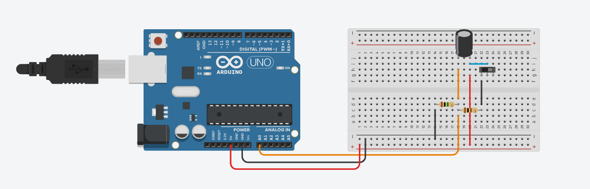
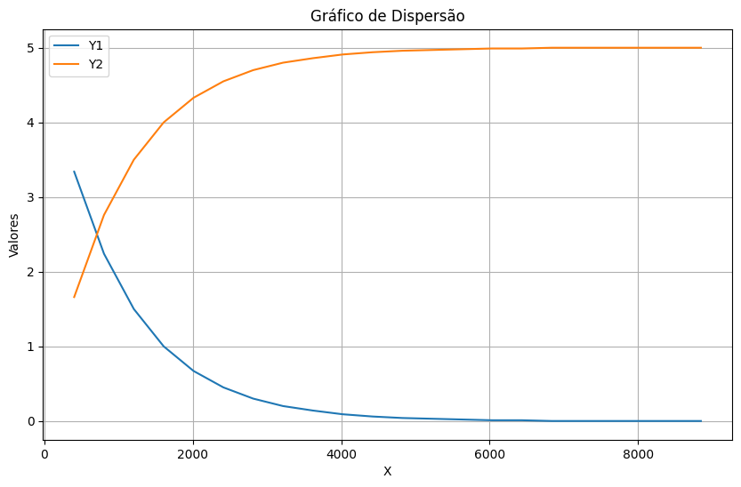

# Ponderada de Programação – Sensores Atuadores Básicos

### Introdução
&emsp;Nesta atividade, foi explorado o comportamento de um circuito RC (resistor-capacitor) por meio de um experimento prático envolvendo programação básica, coleta de dados e análise de resultados. O objetivo foi compreender como o circuito atua como filtro, observando a relação entre a tensão, o tempo e a constante de carga e descarga do capacitor.

A partir dos dados coletados no experimento, foi possível preencher um gráfico e analisar a resposta do sistema. Essa análise permitiu consolidar os conceitos teóricos sobre circuitos RC e compreender sua aplicação prática em sistemas de filtragem.


### O circuito

<div align="center">
<sub>Imagem 01: Circuito.</sub>
</div>
<div align="center">

</div>

<div align="center">
<sub>Fonte: Imagem autoral, 2025.</sub>
</div>

### Descrição
&emsp;O experimento foi montado utilizando um Arduino Uno conectado a uma protoboard, formando um circuito RC simples (resistor e capacitor) com controle por meio de um botão push-button. O circuito permitiu observar o processo de carga e descarga do capacitor, com a leitura da tensão sendo feita pela entrada analógica do Arduino.

Durante o experimento, o Arduino foi programado para coletar os valores de tensão ao longo do tempo, possibilitando a análise do comportamento do capacitor e a verificação da resposta característica do circuito RC.

### Código Utilizado

```cpp
int pinoNoRC=0; 
int valorLido = 0;
float tensaoCapacitor = 0, tensaoResistor;
unsigned long time; 
void setup(){ 
Serial.begin(9600); 
} 
void loop() { 
	time=millis(); 
	valorLido=analogRead(pinoNoRC); 
	tensaoResistor=(valorLido*5.0/1023); // 5.0V / 1023 degraus = 0.0048876 
	tensaoCapacitor = abs(5.0-tensaoResistor);
 	Serial.print(time); //imprime o conteúdo de time no MONITOR SERIAL
    Serial.print(" "); 
  	Serial.print(tensaoResistor);
  	Serial.print(" ");
  	Serial.println(tensaoCapacitor); 
	delay(400); 
}
```


### Funcionamento
&emsp;O código realiza a leitura da tensão em um circuito RC (resistor-capacitor). A cada intervalo de 0,4 segundos, o programa mede a tensão no ponto entre o resistor e o capacitor, calcula os valores correspondentes à tensão no resistor e à tensão no capacitor, e envia esses dados ao Monitor Serial.

Por meio das informações exibidas no monitor, é possível observar o processo de carga e descarga do capacitor ao longo do tempo, permitindo analisar o comportamento do circuito RC e compreender sua função como filtro.

### Evidências

Vídeo Demonstração: 

[Vídeo Capacitor](https://youtu.be/hOUjMogX8hgQ)


### A análise

&emsp;No Google Colab, foi implementado um código para processar os dados coletados e transformá-los em uma representação visual por meio de gráficos, facilitando a interpretação e a análise dos resultados.

### Código Utilizado

```cpp
import matplotlib.pyplot as plt
# Meus dados
dados = [
   (401, 3.34, 1.66),
(803, 2.24, 2.76),
(1205, 1.50, 3.50),
(1607, 1.00, 4.00),
(2010, 0.67, 4.33),
(2412, 0.45, 4.55),
(2813, 0.30, 4.70),
(3216, 0.20, 4.80),
(3618, 0.14, 4.86),
(4021, 0.09, 4.91),
(4423, 0.06, 4.94),
(4825, 0.04, 4.96),
(5227, 0.03, 4.97),
(5629, 0.02, 4.98),
(6032, 0.01, 4.99),
(6433, 0.01, 4.99),
(6836, 0.00, 5.00),
(7238, 0.00, 5.00),
(7641, 0.00, 5.00),
(8043, 0.00, 5.00),
(8444, 0.00, 5.00),
(8847, 0.00, 5.00),

]

# Separando os dados
x = [item[0] for item in dados]
y1 = [item[1] for item in dados]
y2 = [item[2] for item in dados]

# Criando o gráfico
plt.figure(figsize=(10, 6))
plt.plot(x, y1, label='Y1')
plt.plot(x, y2, label='Y2')
# Configurando rótulos e título
plt.xlabel('X')
plt.ylabel('Valores')
plt.title('Gráfico de Dispersão')
plt.legend()
# Exibindo o gráfico
plt.grid(True)
plt.show()
```
### Gráfico Obtido

<div align="center">
<sub>Imagem 02: Gráfico Gerado.</sub>
</div>
<div align="center">

</div>

<div align="center">
<sub>Fonte: Imagem autoral, 2025.</sub>
</div>

###  Conclusão
&emsp;A realização do experimento permitiu compreender, na prática, o comportamento de um circuito RC e a forma como ocorre o processo de carga e descarga do capacitor ao longo do tempo. A partir dos dados coletados pelo Arduino, foi possível observar a variação da tensão no capacitor e no resistor, verificando a resposta característica exponencial do sistema.

Além de reforçar os conceitos teóricos de eletrônica, a atividade também possibilitou aplicar programação básica para aquisição e análise de dados, integrando conhecimentos de hardware e software em um mesmo experimento. Essa integração mostrou-se essencial para entender como circuitos simples podem ser utilizados em aplicações reais de filtragem e temporização.